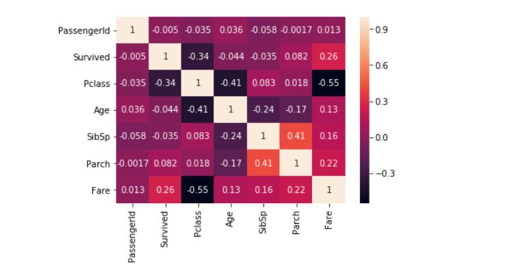
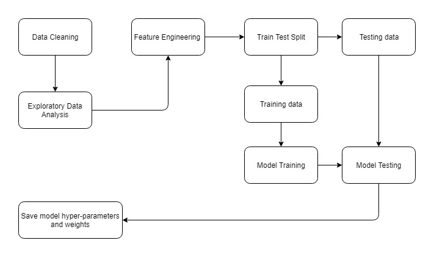

# Logistic Regression for Predicting Survived Passengers

 <br>

The data used for this project can found [here](https://www.kaggle.com/c/titanic) <br>
**Thank you for going through my GitHub repository!**<br><br>
In this project, I have used python libraries within the data science ecosystem to process and predict the survived passengers, based on supporting features included in the data set, with the help of machine learning.

## Libraries Used:
For this project, the libraries used are:
>* [NumPy](https://github.com/numpy/numpy)
>* [Pandas](https://github.com/pandas-dev/pandas)
>* [Matplotlib](https://github.com/matplotlib/matplotlib)
>* [seaborn](https://github.com/mwaskom/seaborn)
>* [scikit-learn](https://github.com/scikit-learn/scikit-learn)

If you do not have these libraries installed, you can easily install these using pip, a package-management system used to install and manage software packages written in Python.<br>
>1. First, you have to install Python, follow the instructions [here](https://www.python.org/downloads/).<br> 
>1. Then for installing the required libraries (if not installed already), use the script below (one by one):

```bash
pip install numpy
pip install pandas
pip install matplotlib
pip install scikit-learn
pip install seaborn
```

There many ways to install these libraries, the most popular choice being through Anaconda Distribution, instructions [here](https://docs.anaconda.com/anaconda/install/). <br>

To check if the libraries are correctly installed, I use this simple trick:
>1. Open your command prompt or terminal.
>1. Type python to call the python shell.
>1. Then type ```import numpy``` to test if NumPy was installed correctly if not errors are received congratulations the library is successfully installed. <br> 

You can use this technique to verify for all the libraries above, if in doubt. 

## Overview:
 <br>
The above depicts a general overview of almost all machine learning projects. 
### Data Cleaning:
* In this project, the data was readily available, but often at times you might need to collect data and aggregate it from various sources. 
* In this phase make sure there no inconsistencies within the data set, null or missing values are taken care of, correct data types linked to every column, or any other data preprocessing steps required.

### Exploratory Data Analysis:
* Get to know the data set your working with, summarize main characteristics. 
* Often this is done through visual plots and graphs; I prefer using seaborn plots like pair plot, joint plots, and counterplots. 

### Feature Engineering:
* It can be tricky sometimes, try to come up with new attributes or derive attributes from the present data set and domain knowledge.
* At times it does increase the performance of the machine learning model significantly. 

### Train Test split:
* We divide the data set into two parts:
  * Training set: Used for training the machine learning model, it can be further divided into a training set and a cross-validation set.
  * Testing set: Used for the final evaluation of the machine learning. 
* The train test split can be seamlessly done by sklearn.model_selection.train_test_split from scikit-learn. 

### Save model hyper-parameters and weights:
* Scikit-learn models can be seamlessly stored and restored with the help of [pickle](https://github.com/python/cpython/blob/master/Lib/pickle.py).

